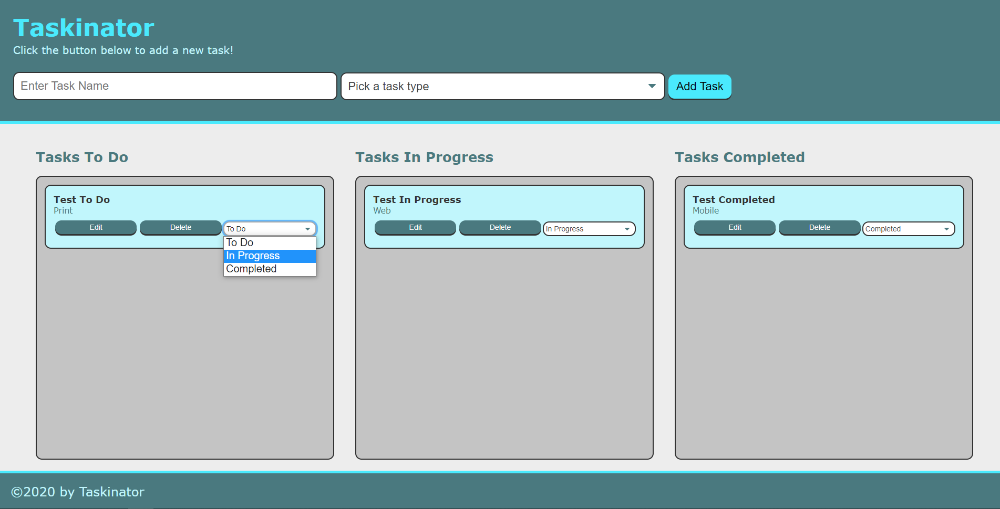

# Taskinator

## Description
Taskinator is an easy and convinent to use web page programmed with only HTML, CSS and Javascript, which allows users to keep track of their necessary tasks. With this webpage the User has the ability to quickly and seamlessly Drag and Drop their tasks into their desired zone based on their progress of said task. Thes tasks will be saved on the browser's internal storage so that the user may return to their tasks at a later time. Preview image as well as a link to the live site are available below!

## Screenshot

## Link

https://jespi116.github.io/taskinator/
